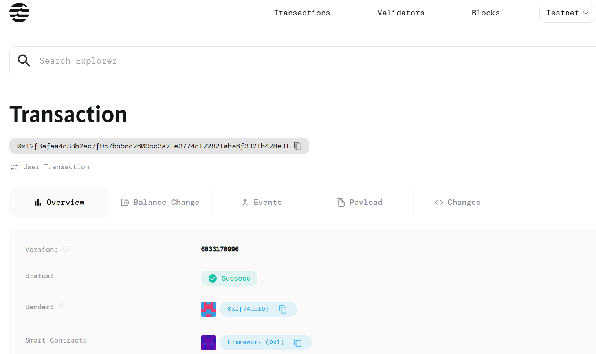

# TokenWithBlacklist

## Project Description

TokenWithBlacklist is an Aptos Move smart contract that implements a secure token management system with approval and allowance mechanisms for delegated transfers. The contract features a built-in blacklist functionality to prevent malicious actors from participating in token transactions, ensuring enhanced security and compliance for decentralized token operations.

## Project Vision

Our vision is to create a robust and secure token infrastructure on the Aptos blockchain that combines the flexibility of delegated transfers with comprehensive security measures. TokenWithBlacklist aims to provide developers and organizations with the tools needed to maintain control over token distribution while enabling trusted third-party operations through a sophisticated approval system.

## Key Features

- **Approval Mechanism**: Allows token holders to grant permission to third parties (spenders) to transfer tokens on their behalf up to a specified limit
- **Allowance Management**: Implements a comprehensive allowance system that tracks and manages approved spending limits between token owners and authorized spenders
- **Blacklist Protection**: Integrated blacklist functionality that prevents blacklisted addresses from participating in any token operations
- **Security-First Design**: All transfer operations include mandatory blacklist checks for all parties involved (sender, recipient, and spender)
- **Delegated Transfers**: Enables secure third-party token transfers through the `transfer_from` function with proper allowance validation
- **Owner Controls**: Contract owner maintains administrative control over the blacklist system
- **Gas Efficient**: Optimized Move code structure for minimal transaction costs on the Aptos network

## Future Scope

- **Multi-Token Support**: Extend the contract to support multiple token types within a single deployment
- **Role-Based Access Control**: Implement granular permission systems for different administrative roles
- **Time-Locked Allowances**: Add expiration dates to approvals for enhanced security
- **Batch Operations**: Enable bulk approval and transfer operations to reduce transaction costs
- **Integration with DeFi Protocols**: Develop interfaces for seamless integration with decentralized exchanges and lending platforms
- **Governance Integration**: Implement on-chain governance for blacklist management and contract upgrades
- **Cross-Chain Compatibility**: Explore bridging capabilities for multi-chain token operations
- **Analytics Dashboard**: Develop monitoring tools for tracking token movements and approval patterns
- **Emergency Pause Mechanism**: Add circuit breaker functionality for emergency situations
- **Automated Compliance**: Integration with regulatory compliance tools and KYC/AML systems

## Contract Details
0x12f3afaa4c33b2ec7f9c7bb5cc2609cc3a21e3774c122821aba6f3921b428e91

